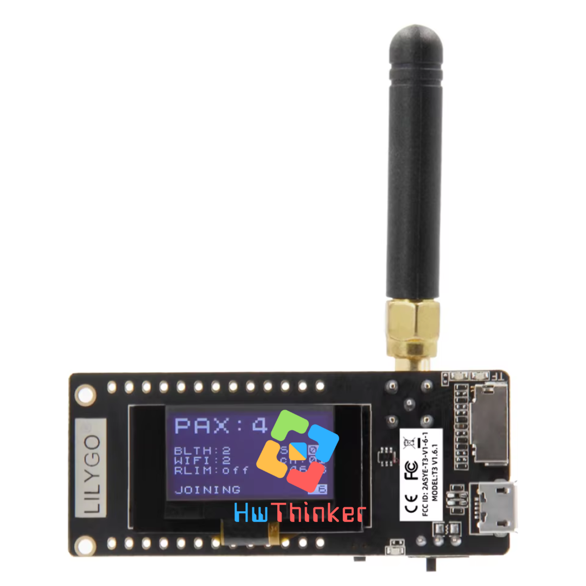

# TTGO Lora 915MHz V2.1



## pinout 


```
LED : IO25
LORA pin : IO18=NSS/SEL
IO5=SCK
IO27=MOSI/SDI
IO19=MISO/SDO
IO26=DI0/IO0
IO23=IRQ/RESET

SD card : SD3-CS-IO13
CMD-MOS1-IO15
CLK-SCK-IO14
SD0-MISO-IO2
DATA2:IO12
DATA2:IO4
```

## Contoh Koding

### Simple Lora

-  [sender](src/01a-sender/main.cpp)  
-  [receiver](src/01b-receiver-loop/main.cpp)  


## Referensi:

- https://github.com/Xinyuan-LilyGO/LilyGo-LoRa-Series/blob/master/examples/RadioLibExamples/SX1276/SX1276_Receive_Interrupt/boards.h?spm=a2g0o.detail.1000023.6.3bb3mQhhmQhhVf&file=boards.h